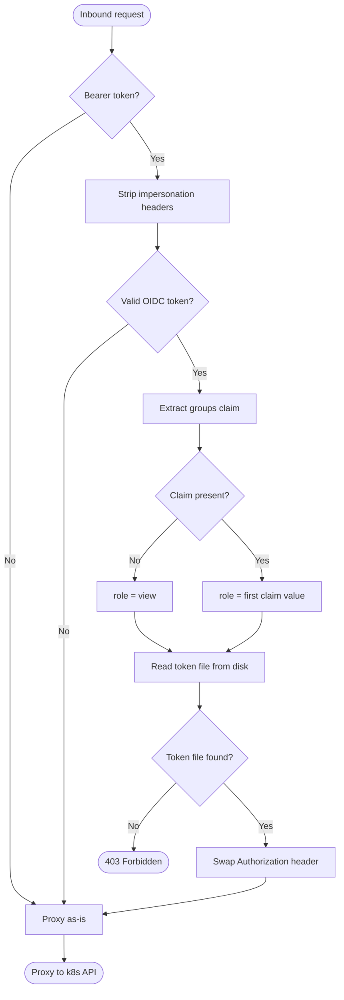

# Auth Decision Logic

Key points:

- **Impersonation headers are always stripped**, even on pass-through requests. A client cannot trick k8s into running a request as a different user by injecting these headers.
- **The role name comes from the OIDC token** (signed by the issuer), not from the client request. The client cannot choose its own role.
- **Missing token file → 403**, not a fallback to a lower-privilege role. A misconfigured deployment fails loudly.
