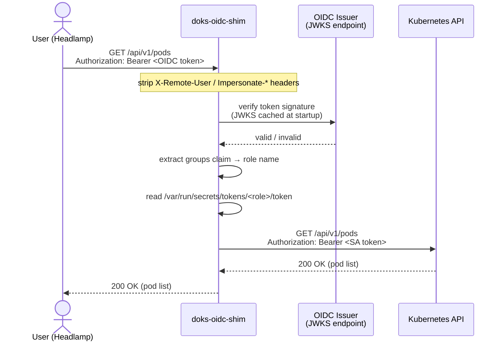
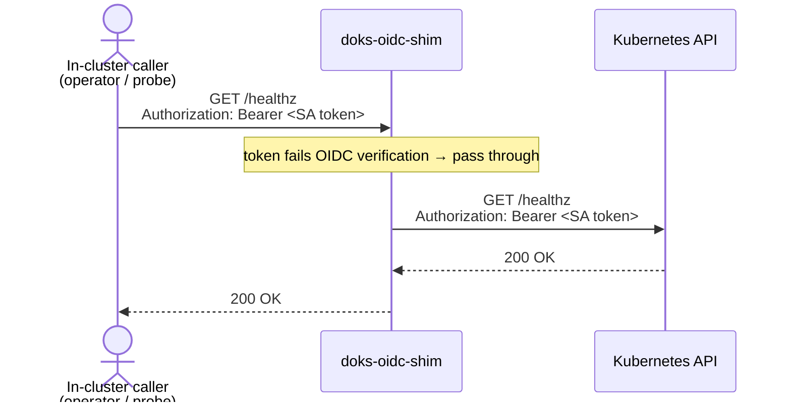

# Request Flow

Two paths through the shim: one for OIDC users (e.g. Headlamp), one for in-cluster callers that already hold a ServiceAccount token (e.g. liveness probes, operators).

## OIDC user request

## In-cluster / pass-through request

Non-OIDC tokens (operators, health checks, the k8s client inside Headlamp's own pod) are forwarded unchanged. The shim cannot verify them — they are authorized entirely by the k8s API server.

