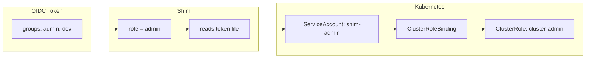
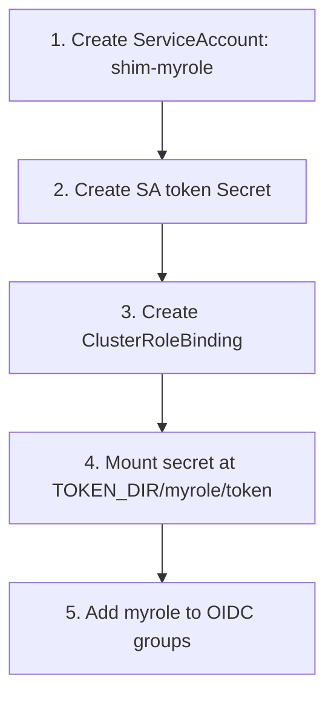

# Role Mapping

How an OIDC identity becomes a set of Kubernetes permissions.

## From claim to ClusterRole



The shim uses the **first** value in the groups claim as the role name. The claim must exactly match a subdirectory name under `TOKEN_DIR`.

## Token directory layout

Each role has its own ServiceAccount in k8s. A long-lived token for that SA is mounted into the shim pod at a predictable path:

```
TOKEN_DIR/                         # default: /var/run/secrets/tokens
├── view/
│   └── token                      ← shim-view SA token  (ClusterRole: view)
├── edit/
│   └── token                      ← shim-edit SA token  (ClusterRole: edit)
└── admin/
    └── token                      ← shim-admin SA token (ClusterRole: cluster-admin)
```

## Adding a new role



Role names must match `[a-zA-Z0-9_-]` — the shim rejects any role name with path characters to prevent directory traversal.
